# Enterprise Network Security Lab

Automated enterprise network security lab built for GNS3. The project uses Python scripts to create a multi-zone network topology, deploy GNS3 nodes and links, generate Cisco IOS/IOSvL2 configurations, configure Ubuntu-based infrastructure services, and run validation checks.

## Project Highlights

- End-to-end GNS3 lab build with Python-based topology automation.
- Enterprise-style segmentation with user, server, voice, printer, guest, DMZ, management, monitoring, backup, identity, security, load balancer, database, and authentication/NTP VLANs.
- Redundant edge and core design with dual ISP routers, dual edge routers, dual pfSense firewalls, dual core switches, and EtherChannel links.
- Cisco IOS/IOSvL2 configuration generation for switch hardening, trunking, STP, DHCP snooping, Dynamic ARP Inspection, port security, SNMPv3, syslog, NTP, and SSH-only management.
- Ubuntu service automation for static networking, BIND9 DNS, Samba Active Directory domain controllers, Chrony NTP, ISC DHCP, and validation tests.
- pfSense lab documentation for interface mapping, WAN gateways, network aliases, service aliases, monitoring rules, and DNS validation.

## Overview

The lab models a small enterprise environment with redundant WAN edges, dual firewalls, a core/access/server switching layer, DMZ services, management services, monitoring, logging, IDS components, and segmented client networks.

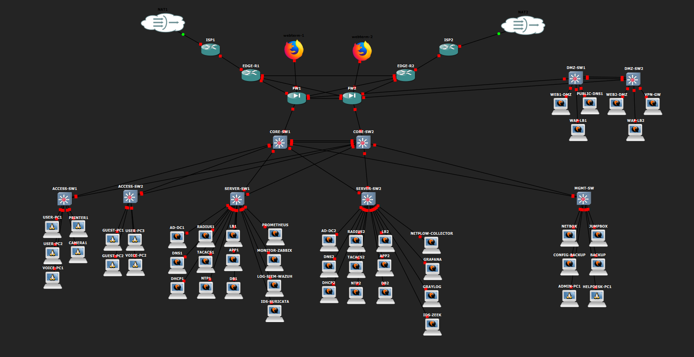

Current topology data includes:

| Item | Count |
| --- | ---: |
| GNS3 nodes | 62 |
| GNS3 links | 73 |
| VLANs | 19 |
| Cisco switch profiles | 9 |
| Ubuntu server/service nodes | 36 |

## Architecture

Main network areas:

- **WAN and Edge:** ISP1, ISP2, EDGE-R1, EDGE-R2 with redundant upstream paths.
- **Firewall Layer:** FW1 and FW2 pfSense nodes connected to edge, core, HA, and DMZ segments.
- **Core Layer:** CORE-SW1 and CORE-SW2 with EtherChannel between the core switches.
- **Access Layer:** user, voice, printer, IoT camera, and guest endpoint VLANs.
- **Server Layer:** application, database, identity, DHCP, DNS, authentication, NTP, monitoring, and security services.
- **DMZ:** public web, WAF/load balancer, public DNS, and VPN gateway nodes.
- **Management:** NetBox, jumpbox, config backup, backup, admin, and helpdesk systems.

## Firewall Lab Data

The pfSense screenshots in `images/` document the firewall state used in the lab.

| Firewall | Interface role | Interface | Address shown in lab |
| --- | --- | --- | --- |
| FW1 | WAN1_EDGE_R1 | em0 | 172.16.11.2/30 |
| FW1 | LAN | em5 | 192.168.99.1/24 |
| FW1 | SYNC | em1 | 172.16.250.1/30 |
| FW1 | INTERNAL_TRUNK | em2 | VLAN trunk |
| FW1 | DMZ_TRUNK | em3 | VLAN trunk |
| FW1 | WAN2_EDGE_R2 | em4 | 172.16.12.2/30 |
| FW2 | WAN | em0 | 172.16.20.2/30 |
| FW2 | LAN | em5 | 192.168.98.1/24 |
| FW2 | SYNC | em1 | 172.16.250.2/30 |
| FW2 | INTERNAL_TRUNK | em2 | VLAN trunk |
| FW2 | DMZ_TRUNK | em3 | VLAN trunk |
| FW2 | WAN2_EDGE_R1 | em4 | 172.16.11.2/30 |

Firewall object data includes network aliases for the 10.10.x enterprise VLAN plan, including user, voice, printer, IoT camera, guest, management, monitoring, backup, DMZ, identity, security/IDS, load balancer, database, admin, and authentication/NTP networks.

Service aliases cover common enterprise/security ports, including DNS, DHCP, NTP, SSH, RDP, web, database, syslog, NetFlow, RADIUS, TACACS, Prometheus, Grafana, Zabbix, Wazuh, Graylog, and backup traffic.

Firewall rules shown in the lab include SNMP access from monitoring servers to pfSense, and DNS validation confirms resolver access for external package repositories.

Additional firewall/router validation screenshots document:

- pfSense WAN/LAN status with WAN `172.16.10.2` and LAN `192.168.99.1`.
- static routes for routed LAN VLAN networks `192.168.10.0/24`, `192.168.20.0/24`, `192.168.30.0/24`, and `192.168.40.0/24` through gateway `172.16.0.2`.
- outbound NAT behavior for routed LAN VLAN sources.
- WAN failover gateway/routing entries using `203.0.113.5` and `198.51.100.9`.
- EDGE-R1 interfaces `203.0.113.2`, `203.0.113.5`, `172.16.255.1`, and `203.0.113.9`.
- EDGE-R2 interfaces `198.51.100.2`, `198.51.100.5`, `172.16.255.2`, and `198.51.100.9`.

<details>
<summary>Firewall screenshots selected for GitHub</summary>

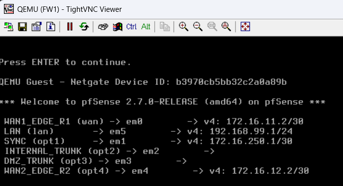

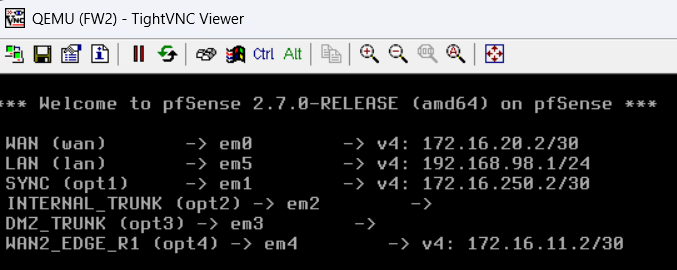

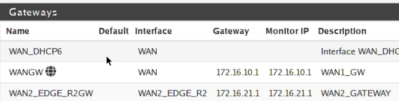

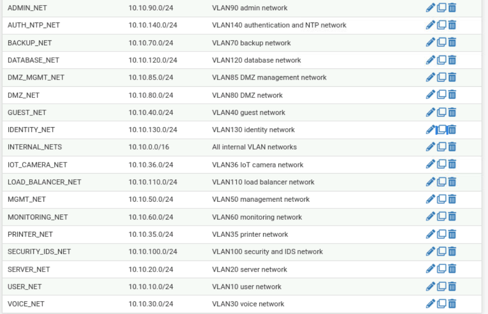

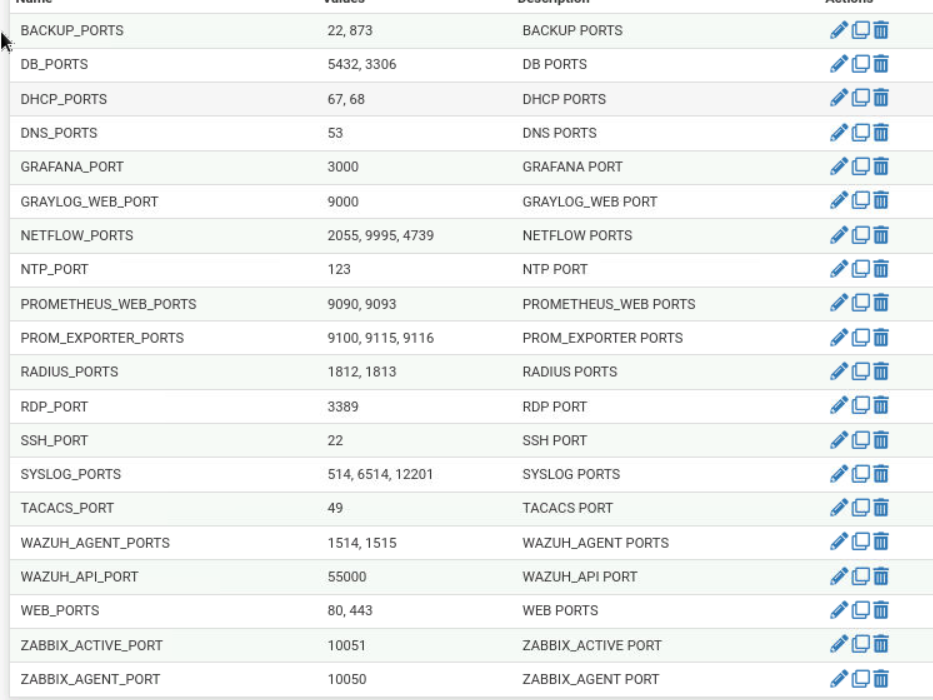

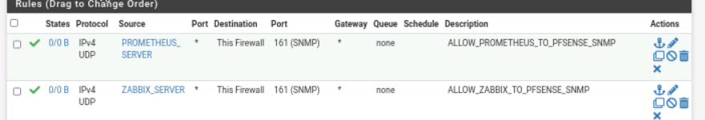

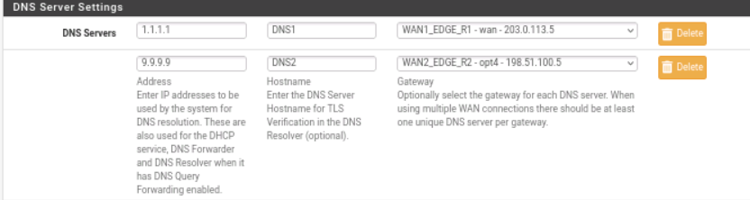

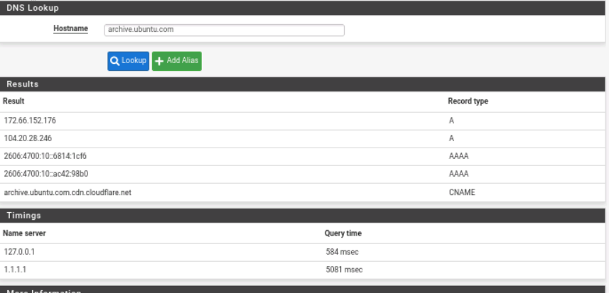

</details>

<details>
<summary>Additional routing and WAN/LAN screenshots</summary>

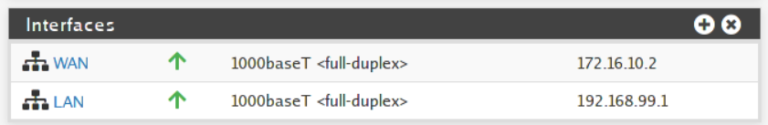

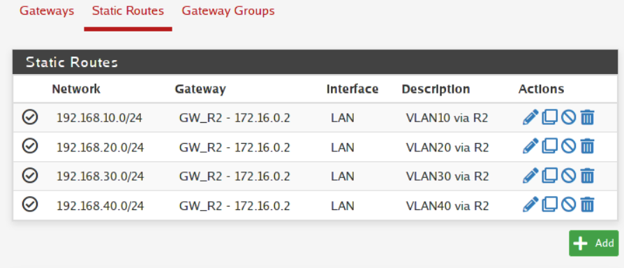

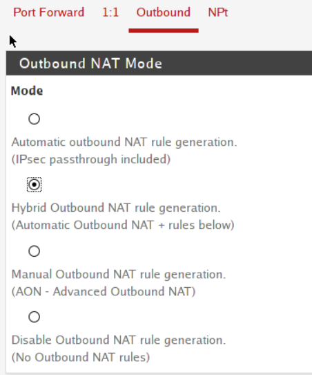

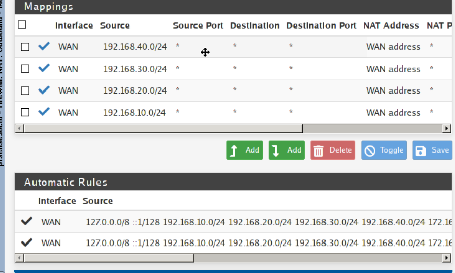

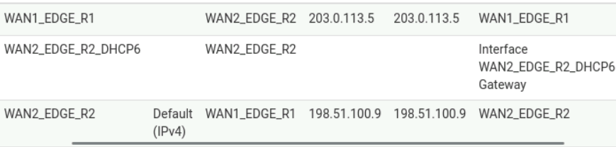

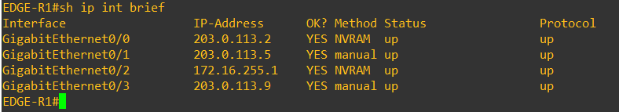

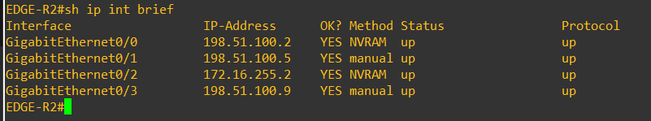

</details>

## VLAN Plan

| VLAN | Name | Purpose |
| ---: | --- | --- |
| 10 | USER | Corporate user clients |
| 20 | SERVER | Application servers |
| 30 | VOICE | Voice clients |
| 35 | PRINTER | Printers |
| 36 | IOT-CAMERA | Camera/IoT devices |
| 40 | GUEST | Guest clients |
| 50 | MANAGEMENT | Network and server management |
| 60 | MONITORING | Monitoring tools |
| 70 | BACKUP | Backup systems |
| 80 | DMZ | Public-facing services |
| 85 | DMZ-MANAGEMENT | DMZ management |
| 90 | ADMIN | Admin/helpdesk workstations |
| 100 | SECURITY-IDS | SIEM, logging, IDS tools |
| 110 | LOAD-BALANCER | Internal load balancers |
| 120 | DATABASE | Database servers |
| 130 | IDENTITY | AD, DNS, DHCP |
| 140 | AUTH-NTP | RADIUS, TACACS, NTP |
| 998 | NATIVE-BLACKHOLE | Native VLAN sink |
| 999 | UNUSED-BLACKHOLE | Unused access port sink |

## Security Features

Generated Cisco configurations include:

- SSH-only VTY access
- local privileged user and enable secret
- HTTP/HTTPS management disabled
- management ACLs for VTY access
- SNMPv3 monitoring access controls
- syslog and NTP configuration
- Rapid PVST and deterministic STP root placement
- EtherChannel trunking between core and DMZ switch pairs
- DHCP snooping and Dynamic ARP Inspection on client VLANs
- DHCP snooping rate limits on access ports
- sticky MAC port security
- BPDU Guard and PortFast on edge ports
- protected access ports for selected client segments
- unused ports moved to VLAN 999 and shut down
- blackhole native VLAN design

## Repository Structure

| File | Purpose |
| --- | --- |
| `gns3_client.py` | Shared helper for GNS3 REST API calls. |
| `network_services.py` | Lab-wide settings such as GNS3 URL, project ID, credentials, domain, NTP, syslog, and SNMP values. |
| `topology_data.py` | GNS3 node definitions, template names, coordinates, and link map. |
| `device_configs.py` | Generated Cisco switch configuration data and builders. |
| `router_configs.py` | Static router configurations for ISP and edge routers. |
| `server_inventory.py` | Ubuntu server inventory, hostnames, IPs, gateways, and prefixes. |
| `server_console.py` | Telnet console helper for Ubuntu-based nodes. |
| `images/` | Selected topology and pfSense screenshots for GitHub README documentation. |
| `01_create_project.py` | Creates a new GNS3 project through the API. |
| `02_list_templates.py` | Lists available GNS3 templates. |
| `03_create_nodes.py` | Creates all nodes from `topology_data.py`. |
| `04_create_links.py` | Creates topology links and skips links that already exist. |
| `05_start_nodes.py` | Starts selected infrastructure nodes. |
| `06_push_configs.py` | Pushes generated switch configurations through console access using Netmiko. |
| `06_push_router_configs.py` | Pushes router configurations for selected router nodes. |
| `07_collect_configs.py` | Collects device running configuration and show-command output. |
| `08_prepare_cisco_ssh_keys.py` | Prepares RSA keys for Cisco SSH support. |
| `09_validate_generated_configs.py` | Performs basic generated-config security checks before deployment. |
| `10_preview_switch_security.py` | Prints selected switch security commands for quick review. |
| `11_list_server_nodes.py` | Lists server nodes and console details. |
| `20_test_server_console.py` / `21_test_server_login.py` | Console and login test helpers. |
| `22_configure_all_server_netplans.py` | Applies static Ubuntu netplan configuration to server nodes. |
| `23_configure_dns_servers.py` | Installs and configures BIND9 recursive DNS forwarders. |
| `23b_test_client_dns.py` | Tests DNS behavior from client nodes. |
| `24_configure_ad_dc1.py` | Provisions the first Samba Active Directory domain controller. |
| `24b_verify_ad_dc1_dns.py` | Verifies AD DC1 DNS and SRV records. |
| `25_configure_ad_dc2.py` | Joins the second Samba Active Directory domain controller. |
| `26_configure_ntp_servers.py` | Installs and configures Chrony NTP servers. |
| `26b_verify_ntp_servers.py` | Verifies NTP services. |
| `27_configure_dhcp_servers.py` | Installs and configures primary/secondary ISC DHCP servers. |
| `27b_verify_dhcp_servers.py` | Verifies DHCP services. |
| `28_test_dhcp_clients.py` / `28b_verify_dhcp_clients_only.py` | Tests DHCP client addressing, gateway, and DNS behavior. |

## Prerequisites

- GNS3 server/controller with API access enabled
- Python 3.10 or newer
- `netmiko` for Cisco console automation
- GNS3 templates with names matching `topology_data.py`:
  - `Cisco IOSv 15.9M6`
  - `Cisco IOSvL2 15.2(20200924:215240)`
  - `pfSense 2.7.0`
  - `Ubuntu Cloud Guest Ubuntu 24.04 LTS (Noble Numbat)`
  - `Toolbox`
- Ubuntu guests with console login available
- Internet/NAT reachability from nodes that install packages through `apt`

Install the Python dependency:

```bash
pip install netmiko
```

## Recommended Run Order

Review and update `network_services.py` before running the automation.

```bash
python 02_list_templates.py
python 01_create_project.py
```

Copy the generated project ID into `network_services.py`, then create the lab topology:

```bash
python 03_create_nodes.py
python 04_create_links.py
python 05_start_nodes.py
```

Validate and apply Cisco configurations:

```bash
python 09_validate_generated_configs.py
python 06_push_router_configs.py
python 06_push_configs.py
python 08_prepare_cisco_ssh_keys.py
python 07_collect_configs.py
```

Configure Ubuntu server networking and services:

```bash
python 22_configure_all_server_netplans.py
python 23_configure_dns_servers.py
python 24_configure_ad_dc1.py
python 24b_verify_ad_dc1_dns.py
python 25_configure_ad_dc2.py
python 26_configure_ntp_servers.py
python 26b_verify_ntp_servers.py
python 27_configure_dhcp_servers.py
python 27b_verify_dhcp_servers.py
python 28_test_dhcp_clients.py
```

## Validation

The repository includes validation helpers for both generated configuration and runtime services:

- `09_validate_generated_configs.py` checks for SSH-only management, HTTP service disablement, logging, NTP, DHCP snooping, DAI, and SNMP placeholder values.
- `10_preview_switch_security.py` prints selected switch hardening commands.
- `24b_verify_ad_dc1_dns.py`, `26b_verify_ntp_servers.py`, and `27b_verify_dhcp_servers.py` verify major service roles.
- `28_test_dhcp_clients.py` validates client IP addressing, default gateways, DNS settings, and basic gateway reachability.

The Python files in this snapshot compile successfully with `py_compile`.

## License

This project is licensed under the MIT License. See the `LICENSE` file for details.
